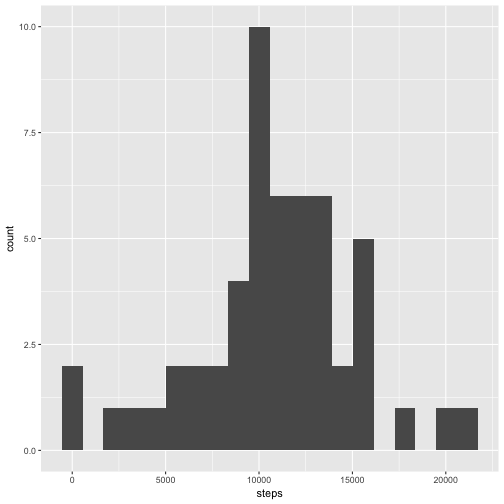
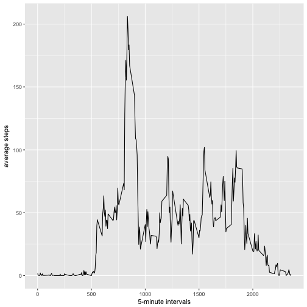

# Project 1 for the course Producible Research on Coursera.com

### Load data and extract some information of features

```r
data<-read.csv("activity.csv",stringsAsFactors = FALSE)
str(data)
```

```
## 'data.frame':	17568 obs. of  3 variables:
##  $ steps   : int  NA NA NA NA NA NA NA NA NA NA ...
##  $ date    : chr  "2012-10-01" "2012-10-01" "2012-10-01" "2012-10-01" ...
##  $ interval: int  0 5 10 15 20 25 30 35 40 45 ...
```

```r
data[5000:5010,]
```

```
##      steps       date interval
## 5000   757 2012-10-18      835
## 5001   608 2012-10-18      840
## 5002   568 2012-10-18      845
## 5003   571 2012-10-18      850
## 5004   355 2012-10-18      855
## 5005    55 2012-10-18      900
## 5006    32 2012-10-18      905
## 5007    79 2012-10-18      910
## 5008    49 2012-10-18      915
## 5009     0 2012-10-18      920
## 5010     0 2012-10-18      925
```

### Processing data
We convert column date to Data format

```r
data$date<-as.Date(data$date,"%Y-%m-%d")
```

## What is mean total number of steps taken per day?

### Group data into days and find the total steps of each days

```r
date_steps<-aggregate(steps~date,data=data,FUN="sum")
str(date_steps)
```

```
## 'data.frame':	53 obs. of  2 variables:
##  $ date : Date, format: "2012-10-02" "2012-10-03" ...
##  $ steps: int  126 11352 12116 13294 15420 11015 12811 9900 10304 17382 ...
```

### Make a histogram of the total number of steps taken each day

```r
require(ggplot2)
ggplot(date_steps,aes(steps))+geom_histogram(bins=20)
```



### Mean and median number of steps taken each day

```r
mean(date_steps$steps)
```

```
## [1] 10766.19
```

```r
median(date_steps$steps)
```

```
## [1] 10765
```

## What is the average daily activity pattern?

### Make a time series plot (i.e. 𝚝𝚢𝚙𝚎 = "𝚕") of the 5-minute interval (x-axis) and the average number of steps taken, averaged across all days (y-axis)


```r
interval.5min<-aggregate(steps~interval,data,mean)
ggplot(interval.5min,aes(interval,steps))+geom_line()+xlab("5-minute intervals")+ylab("average steps")
```



###Which 5-minute interval, on average across all the days in the dataset, contains the maximum number of steps?


```r
max<-which(interval.5min$steps==max(interval.5min$steps))
interval.5min[104,]
```

```
##     interval    steps
## 104      835 206.1698
```
## Imputing missing values

Note that there are a number of days/intervals where there are missing values (coded as 𝙽𝙰). The presence of missing days may introduce bias into some calculations or summaries of the data.

### Calculate and report the total number of missing values in the dataset (i.e. the total number of rows with 𝙽𝙰s)


```r
missing<-subset(data,is.na(data))
nrow(missing)
```

```
## [1] 2304
```

### Devise a strategy for filling in all of the missing values in the dataset. The strategy does not need to be sophisticated. For example, you could use the mean/median for that day, or the mean for that 5-minute interval, etc.
To fill in the missing data, we should not use the mean/median of that day since somedays the data is empty for entire day. In this situation we can use the average number of steps for the 5-minute interval for which that observation belongs to.

### Create a new dataset that is equal to the original dataset but with the missing data filled in.


```r
imputed_data<-data

for ( i in 1:nrow(imputed_data)){
    if (is.na(imputed_data[i,1])){
        imputed_data[i,1]<-interval.5min[(i-1)%%288+1,2]
    }
}
```

### Make a histogram of the total number of steps taken each day and Calculate and report the mean and median total number of steps taken per day. Do these values differ from the estimates from the first part of the assignment? What is the impact of imputing missing data on the estimates of the total daily number of steps?

```r
imputed_date_steps<-aggregate(steps~date,data=data,FUN="sum")
ggplot(imputed_date_steps,aes(steps))+geom_histogram(bins=20)
```


```r
mean(imputed_date_steps$steps)
```

```
## [1] 10766.19
```

```r
median(imputed_date_steps$steps)
```

```
## [1] 10765
```
By this imputing method for the missing data, the mean and median do not change. 
## Are there differences in activity patterns between weekdays and weekends?

For this part the 𝚠𝚎𝚎𝚔𝚍𝚊𝚢𝚜() function may be of some help here. Use the dataset with the filled-in missing values for this part.

### Create a new factor variable in the dataset with two levels – “weekday” and “weekend” indicating whether a given date is a weekday or weekend day.


```r
imputed_data$weekday<-ifelse(weekdays(imputed_data$date,abbreviate = TRUE)%in%c("Sun","Sat"),"weekend","weekday")
table(imputed_data$weekday)
```

```
## 
## weekday weekend 
##   12960    4608
```

### Make a panel plot containing a time series plot (i.e. 𝚝𝚢𝚙𝚎 = "𝚕") of the 5-minute interval (x-axis) and the average number of steps taken, averaged across all weekday days or weekend days (y-axis). See the README file in the GitHub repository to see an example of what this plot should look like using simulated data.


```r
imputed.interval.5min<-aggregate(steps~interval+weekday,imputed_data,mean)
ggplot(imputed.interval.5min,aes(interval,steps))+geom_line()+xlab("5-minute intervals")+ylab("average steps")+facet_number ofeekday,ncol=1)
```

```
## Error: <text>:2:125: unexpected symbol
## 1: imputed.interval.5min<-aggregate(steps~interval+weekday,imputed_data,mean)
## 2: ggplot(imputed.interval.5min,aes(interval,steps))+geom_line()+xlab("5-minute intervals")+ylab("average steps")+facet_number ofeekday
##                                                                                                                                ^
```
